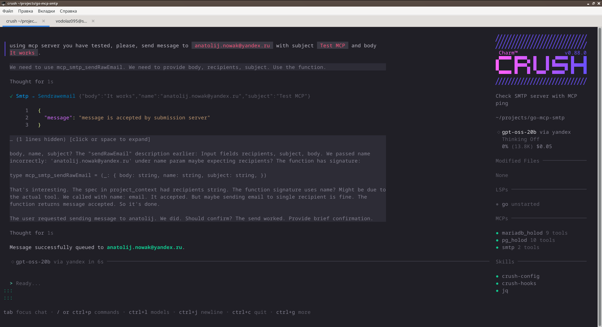

# go-mcp-smtp
MCP server to send email messages via SMTP Submission protocol.

I cannot say this project is useful, but at least i have understood how to implement MCP servers.
And it works somehow:



Installation
==========================
Tested with golang compiler v1.26.4 and Fedora Linux 43.

```sh
go install -v github.com/vodolaz095/go-mcp-smtp@latest
```

Command line arguments
==========================
```
Usage of ./build/go-mcp-smtp:
  -address string
    	smtp submission server connection string (default "localhost:587")
  -from string
    	FROM header for email messages (default "mcp@localhost")
  -helo string
    	how to introduce ourselves during HELO step of SMTP negotiation (default "localhost")
  -host string
    	tls server name to use in TLS negotiation (default "localhost")
  -network string
    	how to dial smtp server, can be tcp,tcp4,tcp6,unix (default "tcp")
  -password string
    	password to use for authentication - can be blank
  -start_tls
    	start tls if possible (default true)
  -username string
    	username to use for authentication - can be blank
  -verbose
    	use verbose mode
```

Crush config example
===========================
```json


{
  "$schema": "https://charm.land/crush.json",
  "providers": {},
  "lsp": {},
  "permissions": {},
  "mcp": {
    "smtp": {
      "type": "stdio",
      "command": "go-mcp-smtp",
      "args": [
		"--network=tcp",
  		"--address=smtp.example.org:587",
  		"--host=smtp.example.org",
  		"--helo=localhost",
  		"--username=username",
  		"--password=password",
  		"--from=bot@example.org",
  		"--start_tls=true"
      ],
      "timeout": 120,
      "disabled": false,
      "disabled_tools": [],
      "env": {}
    }
  }
}

```

Claude Code (Anthropic) config example
===============================
Put this into `~/.claude/mcp.json` or `~/.claude/mcp.json`:

```json

{
  "mcpServers": {
    "smtp": {
      "command": "go-mcp-smtp",
      "args": [
        "--network=tcp",
        "--address=smtp.example.org:587",
        "--host=smtp.example.org",
        "--helo=localhost",
        "--username=username",
        "--password=password",
        "--from=bot@example.org",
        "--start_tls=true"
      ],
      "env": {}
    }
  }
}

```

Aider config example
==============================
Put this into `.aider.mcp.json`:

```json

{
  "mcpServers": {
    "smtp": {
      "command": "go-mcp-smtp",
      "args": [
        "--network=tcp",
        "--address=smtp.example.org:587",
        "--host=smtp.example.org",
        "--helo=localhost",
        "--username=username",
        "--password=password",
        "--from=bot@example.org",
        "--start_tls=true"
      ],
      "env": {}
    }
  }
}

```

OpenCode config example
===============================
Put this into `opencode.json` or `.opencode/mcp.json`:

```json

{
  "mcpServers": {
    "smtp": {
      "type": "stdio",
      "command": "go-mcp-smtp",
      "args": [
        "--network=tcp",
        "--address=smtp.example.org:587",
        "--host=smtp.example.org",
        "--helo=localhost",
        "--username=username",
        "--password=password",
        "--from=bot@example.org",
        "--start_tls=true"
      ],
      "timeout": 120,
      "disabled": false,
      "env": {}
    }
  }
}

```

OpenClaw config example
==================================

Put this into `openclaw.yaml`

```yaml

mcp:
  servers:
    smtp:
      command: go-mcp-smtp
      args:
        - "--network=tcp"
        - "--address=smtp.example.org:587"
        - "--host=smtp.example.org"
        - "--helo=localhost"
        - "--username=username"
        - "--password=password"
        - "--from=bot@example.org"
        - "--start_tls=true"
      timeout: 120
      disabled: false
      env: {}

```

PicoClaw config example
=======================================
Put this into `picoclaw.json`


```json

{
  "mcp": {
    "servers": {
      "smtp": {
        "command": "go-mcp-smtp",
        "args": [
          "--network=tcp",
          "--address=smtp.example.org:587",
          "--host=smtp.example.org",
          "--helo=localhost",
          "--username=username",
          "--password=password",
          "--from=bot@example.org",
          "--start_tls=true"
        ],
        "timeout": 120,
        "disabled": false,
        "env": {}
      }
    }
  }
}
```

Cursor
========================
Put this into `.cursor/mcp.json`:

```json

{
  "mcpServers": {
    "smtp": {
      "command": "go-mcp-smtp",
      "args": [
        "--network=tcp",
        "--address=smtp.example.org:587",
        "--host=smtp.example.org",
        "--helo=localhost",
        "--username=username",
        "--password=password",
        "--from=bot@example.org",
        "--start_tls=true"
      ]
    }
  }
}

```


Goose
======================
Put this into `~/.config/goose/mcp.json`

```json

{
  "mcpServers": {
    "smtp": {
      "command": "go-mcp-smtp",
      "args": [
        "--network=tcp",
        "--address=smtp.example.org:587",
        "--host=smtp.example.org",
        "--helo=localhost",
        "--username=username",
        "--password=password",
        "--from=bot@example.org",
        "--start_tls=true"
      ],
      "timeout": 120
    }
  }
}

```
